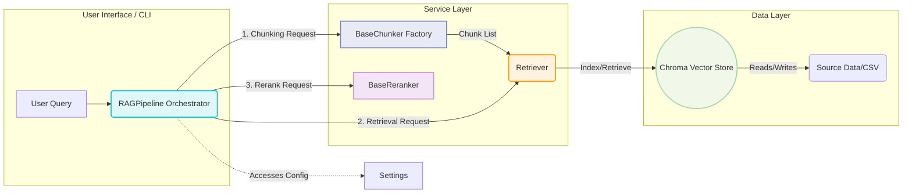

# ⚙️ RAG Pipeline: Engineering Handbook

## 🎯 System Purpose
This repository implements a modular, high-performance Retrieval-Augmented Generation (RAG) pipeline. Its function is to transform raw, unstructured data into contextualized knowledge suitable for LLM consumption. The architecture is built around the **Service Orchestration Pattern**, ensuring maximum modularity, high testability, and clear separation of concerns.

## 🗺️ Architecture & Data Flow
The system operates across four functional tiers: **Configuration $\rightarrow$ Services $\rightarrow$ Orchestrator $\rightarrow$ Data Layer.**

### System Mechanism Diagram


## 📦 Project Structure (File Hierarchy)
The module design enforces a flat, feature-level organization under `src/`, removing unnecessary nesting.

```
local-rag-pipeline/
├── data/                         # Source CSVs (the local Chroma DB is created here, git-ignored)
├── src/                          # Core Application Modules (The Feature Set)
│   ├── main.py                   # CLI entry point (`local-rag`).
│   ├── pipeline.py               # Main Orchestrator Class: RAGPipeline.
│   ├── loaders.py                # CSV -> Document loading with column validation.
│   ├── config/
│   │   └── settings.py           # Settings dataclass (validation, YAML load/save).
│   ├── chunking/                 # Modular Chunking Service Suite
│   │   ├── base.py               # BaseChunker (own module => no circular imports).
│   │   ├── strategies.py         # Factory: get_chunker + re-exports of all chunkers.
│   │   ├── fixed_size.py         # CharacterTextSplitter utility.
│   │   ├── recursive.py          # RecursiveCharacterTextSplitter utility.
│   │   ├── document.py           # Paragraph-based splitting.
│   │   ├── semantic.py           # Embedding-based topic-change splitting.
│   │   ├── propositional.py      # One chunk per sentence; plug in an `extractor` for LLM propositions.
│   │   └── agentic.py            # Plug in an agent callable; falls back to recursive splitting.
│   ├── retrieval/
│   │   └── retriever.py          # Retriever: lazy Chroma access (index + query).
│   └── reranking/
│       └── reranker.py           # EmbeddingReranker (cosine similarity).
├── tests/                        # pytest suite (no Ollama required)
├── pyproject.toml                # Project metadata, dependencies, pytest config.
├── README.md
└── LICENSE
```

**Import rule:** modules inside a package never import from their own package's factory
(`strategies.py`); they import from `base.py`. Dependencies only point one way:
`base.py <- concrete chunkers <- strategies.py`.

## 🧪 Operational Guide: Execution
### 1. Environment Setup
```bash
pip install -r requirements.txt
ollama pull mxbai-embed-large   # embedding model (see settings)
ollama pull llama3.2            # LLM (see settings)
```
Run from the repository root, either `python src/main.py ...` or, after `pip install -e .`, `local-rag ...`.

### 2. Data Ingestion (Indexing)
```bash
local-rag --data data/realistic_restaurent_reviews.csv
```
The CSV needs the columns `Title`, `Date`, `Rating`, `Review`; a missing column produces a clear error.
If the vector store is empty on startup, the bundled data set is indexed automatically.
Indexing is idempotent: running it twice does not create duplicates.

### 3. Querying (Retrieval)
```bash
local-rag --question "What do people say about the pizza?"   # single question
local-rag                                                    # interactive mode
local-rag --config my_settings.yaml -k 5 -q "..."            # custom settings
```

### 4. Developer Integration (Python)
```python
from langchain_core.documents import Document
from config.settings import Settings
from pipeline import RAGPipeline

pipeline = RAGPipeline(settings=Settings())
pipeline.add_documents([Document(page_content="...", metadata={"source": "demo"})])
context = pipeline.get_context("query")
```

### 5. Tests
```bash
pip install pytest
python -m pytest
```

## 🧠 Next Development Milestones (Current Task Focus)
1.  **`PropositionalChunker`**: Provide an `extractor` (LLM or dependency parser) that returns atomic propositions.
2.  **`AgenticChunker`**: Provide an `agent(text, chunk_size) -> list[str]` callable backed by an LLM.
3.  **`SemanticChunker`**: Tune `similarity_threshold` on real data, or switch to percentile-based breakpoints.