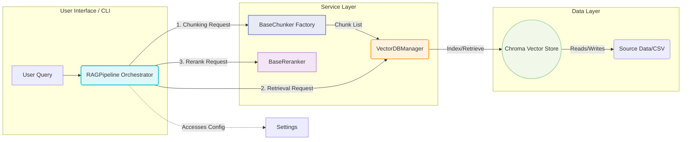

# ⚙️ RAG Pipeline: Engineering Handbook

## 🎯 System Purpose
This repository implements a modular, high-performance Retrieval-Augmented Generation (RAG) pipeline. Its function is to transform raw, unstructured data into contextualized knowledge suitable for LLM consumption. The architecture is built around the **Service Orchestration Pattern**, ensuring maximum modularity, high testability, and clear separation of concerns.

## 🗺️ Architecture & Data Flow
The system operates across four functional tiers: **Configuration $\rightarrow$ Services $\rightarrow$ Orchestrator $\rightarrow$ Data Layer.**

### System Mechanism Diagram


## 📦 Project Structure (File Hierarchy)
The module design enforces a flat, feature-level organization under `src/`, removing unnecessary nesting.

```
local-rag-pipeline/
├── data/                         # Directory for persistent state (DB, source CSVs)
├── src/                          # Core Application Modules (The Feature Set)
│   ├── config/                   # Global configuration handlers
│   │   └── settings.py           # Contains the Settings dataclass for pipeline configuration.
│   ├── pipeline.py               # Main Orchestrator Class: RAGPipeline.
│   ├── vector.py                 # VectorDBManager: Manages Chroma I/O via Lazy Loading.
│   ├── chunking/                 # Modular Chunking Service Suite
│   │   ├── __init__.py
│   │   ├── strategies.py         # Factory: Centralized routing logic (get_chunker).
│   │   ├── fixed_size.py         # Implementation: CharacterTextSplitter utility.
│   │   ├── recursive.py          # Implementation: RecursiveCharacterTextSplitter utility.
│   │   ├── document.py           # Implementation: Paragraph-based splitting.
│   │   ├── semantic.py           # Blueprint: Semantic Clustering Logic (Requires ML Service Integration).
│   │   ├── propositional.py      # Blueprint: Proposition Extraction Logic (Requires NLP Parser Integration).
│   │   └── agentic.py            # Blueprint: Orchestrates splitting via Agent Tool.
│   └── retrieval/
│       └── retriever.py          # The Retriever Service Class.
├── tests/                        # Automated Test Suite
│   ├── config/
│   │   └── test_settings.py     # Tests Settings validation and YAML loading.
│   ├── pipeline/
│   │   └── test_pipeline.py     # Integration tests for full RAGPipeline flow (uses mocks).
│   ├── chunking/
│   │   └── test_strategies.py   # Unit tests for all chunker implementations.
│   └── reranking/
│       └── test_reranker.py     # Unit tests for similarity calculation logic.
├── pyproject.toml                # Project metadata & dependencies definition.
├── README.md
└── LICENSE
```

## 🧪 Operational Guide: Execution
### 1. Environment Setup
```bash
pip install -r requirements.txt
```

### 2. Data Ingestion (Indexing)
Use the command-line interface (`local-rag`) to load external data into the vector store.
```bash
local-rag --data path/to/data.csv
```
**⚠️ Data Validation:** The system performs row-level validation on the source CSV to prevent crashes from column name mismatch.

### 3. Querying (Retrieval)
Use the CLI for immediate results:
```bash
local-rag --question "What is the core function of the RAG system?"
```

### 4. Developer Integration (Python)
For deep integration, instantiate services directly:
```python
from src.config.settings import Settings
from src.pipeline import RAGPipeline
from src.vector import VectorDBManager

# 1. Configuration
settings = Settings()
# 2. Data Layer Initialization
db_manager = VectorDBManager(settings=settings)

# 3. Pipeline Orchestration
pipeline = RAGPipeline(settings=settings)

# 4. Run pipeline
pipeline.add_documents(documents_list)
context = pipeline.get_context("query")
```

## 🧠 Next Development Milestones (Current Task Focus)
The code is structurally sound. The next development phase is integrating external ML/NLP libraries into the blueprints:
1.  **`SemanticChunker`**: Integrate actual embedding and clustering logic here.
2.  **`PropositionalChunker`**: Integrate a Dependency Parsing service call here.
3.  **`AgenticChunker`**: Finalize the Agent orchestration hook to execute the splitting logic via the Claude Agent.